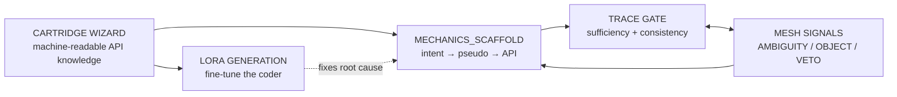

# Pipeline Planning Docs — Index

> Single map of the pipeline's planning documents: what each covers, which track it
> belongs to, how they compose, and what is implemented vs. still a plan.
> Updated: 2026-09-17.

---

## How they line up

The chain reads left-to-right as **one narrative**:

1. **Mechanics Scaffold** — separate *reasoning* (intent/pseudocode) from *API binding* so the
   coder translates a known shape instead of inventing code. Fixes the current failure at the
   source.
2. **Trace Gate** — validate that scaffold's sufficiency and internal consistency *before* any
   code is written.
3. **Mesh Signals** — let agents argue when the scaffold/request is underspecified or
   self-contradictory (`AMBIGUITY` → Trace Gate).
4. **Cartridge Wizard** — produce the machine-readable API knowledge the scaffold's `API:`
   column reads (portability).
5. **LoRA Generation** — fine-tune the coder on that API knowledge, attacking the *root cause*
   (the model doesn't know the API) rather than patching around it.

---

## Track A — Runtime hardening (the active work)

| Doc | Purpose | Status |
|---|---|---|
| `docs/MECHANICS_SCAFFOLD_PLAN.md` | Bounded intent→pseudocode→API scaffold between Architect JSON and anchor code | 📄 Plan |
| `docs/SPEC_TRACE_GATE_PLAN.md` | Trace a request/code/doc; score sufficiency + detect contradictions | 📄 Plan |
| `docs/MESH_SIGNAL_ARGUMENTATION_PLAN.md` | How agents emit/argue via signals (4-point wiring + `AMBIGUITY`) | 📄 Plan |

> **Note:** while these three are *plans*, the session that produced them also shipped
> supporting code: deterministic post-process fixes #17–#26, the tribunal↔coder debate loop,
> full-path luac resolution, and the prompt changes in `cartridges/midway_data.py`.

## Track B — Portability (other projects / models / hardware)

| Doc | Purpose | Status |
|---|---|---|
| `docs/CARTRIDGE_WIZARD_PLAN.md` | Autonomously build cartridges from a repo's headers/docs | 📄 Plan (cartridge architecture ✅, wizard ⚠️ stub) |
| `docs/LORA_GENERATION_DESIGN.md` | Generate a LoRA adapter per (model × cartridge) from API knowledge | 📄 Plan |
| `docs/ACQUISITION_PHASE_PLAN.md` | UE4 knowledge discovery + API scraping | 📄 Plan |
| `wizard_roadmap.md` | The 5-stage acquisition design the Cartridge Wizard implements | 📄 Design only |

## Track C — UE4 target

| Doc | Purpose | Status |
|---|---|---|
| `docs/UE4_SOLID_PLAN.md` | UE4 cartridge plan | 📄 Plan |
| `docs/UE4_MASTER_INDEX.md` | UE4 master index | 📄 Reference |
| `docs/UE4_CARTRIDGE_README.md` | UE4 cartridge readme | 📄 Reference |

---

## Status legend

- ✅ **Implemented** — code shipped and live.
- ⚠️ **Partial** — some parts exist, some are stubs.
- 📄 **Plan** — design documented, nothing implemented yet.

## Where to start (recommended implementation order)

Track A first, in composition order:

1. **Mechanics Scaffold** — highest leverage; it is the direct fix for the coder's
   logic+API failure, and the other two compose around it.
2. **Trace Gate** — validates the scaffold; the deterministic half (dangling refs, numeric
   conflicts, orphan units) reuses `_lua_symbol_table` already shipped.
3. **Mesh Signals** — the `AMBIGUITY` four-point wiring (prompt → enum → parser → dispatcher);
   small, and it closes the loop back to the Trace Gate.

Track B (Cartridge Wizard → LoRA) only after Track A proves out — they are the
portability/long-term fixes, not the convergence fixes.

---

## Out of scope of this index

The *game's* documentation (`GDD`, `engine_lua_bridge_contract.md`, attraction specs, etc.)
is indexed separately in `docs/index.md`. This file indexes the **pipeline's planning docs**
only.
