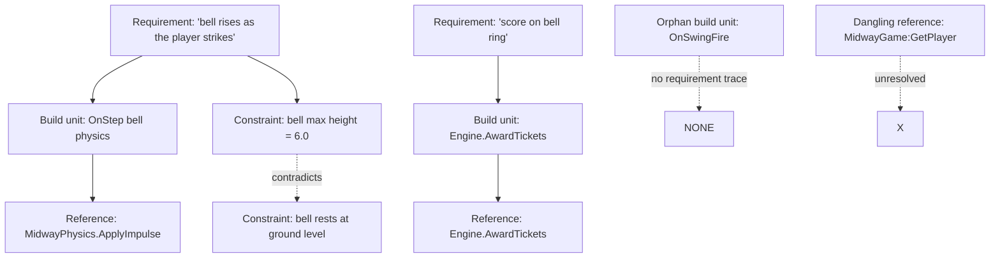

# Specification Trace Gate ("TraceGate") — Implementation Plan

> Saved from planning session, 2026-09-17.
> Premise: **a request, a piece of code, or a document can be traced as a graph of
> requirements, build units, and references.** Sufficiency is a vertical check
> (is there enough to build each requirement?), and coherence is a horizontal check
> (do any two items contradict each other?). Both are checkable — deterministically
> where the content is parseable, by bounded LLM judgment where it is prose.
> Goals: give the pipeline a stage that can be activated **on-demand** (user asks for
> review) or **automatically** (an agent flags ambiguity), and that answers two
> questions before anything is built: *is this sufficient?* and *is this internally
> consistent?*
>
> **Implementation status (2026-09-21):** NOT built. The `AMBIGUITY` signal it consumes
> is shipped (see `MESH_SIGNAL_ARGUMENTATION_PLAN.md` Phase 0/1), but `trace_gate.py`
> itself — the trace model, the two analysis axes, and the `run_trace_gate(...)` entry
> point — does not exist yet.

---

## 1. Current state (what exists vs. what this adds)

| Piece | State | Relationship to TraceGate |
|---|---|---|
| `clarification_gate.py` | ✅ pre-blueprint **specificity** classifier (SPECIFIC vs VAGUE, proposes 3 directions) | The coarse binary predecessor. TraceGate decomposes the same question per-requirement and adds the *consistency* axis it cannot see. |
| `contract_validator.py` | ✅ deterministic bridge-contract conformance (phantom names, bare calls) | Supplies the **reference-resolution** and **phantom-API** deterministic checks. |
| `midway_api_signatures.py` | ✅ arity tables (`SPAWN_ARITY`, `BODY_ARITY`, `ECONOMY_ARITY`) | Supplies the **arity** consistency check. |
| `runtime_sim.py` | ✅ headless runtime/phantom/arity analysis (`run_phantom_api_final_pass`) | Supplies the **final** consistency check; TraceGate runs the same class of check *before* code exists. |
| `_post_process_lua.py::_lua_symbol_table` | ✅ scope-aware (declared, assigned, read) symbol sets | Reused verbatim for **dangling-reference** and **orphan build-unit** detection. |
| `models.py` (`SignalType`, `MeshSignal`, `PipelineContext`) | ✅ `SignalType.AMBIGUITY` + `PipelineContext.ambiguity_signals` (record-only) | Signal plumbing is shipped; routing those findings into the gate is this plan's Phase 4. |
| `paging_controller.py` / `paging_kernel.py` | ✅ context paging | Needed to trace documents larger than the model context window. |

> **Signal/argumentation mechanics live in a separate doc.** How an agent learns it can emit
> `AMBIGUITY` (the four-point wiring) and how the personas argue via OBJECT/VETO/APPEAL/CONSULT
> is specified in `MESH_SIGNAL_ARGUMENTATION_PLAN.md`, not here. This doc *consumes* those
> signals; it does not define the communication layer.

**What does not exist yet:** a single stage that *traces* a request/code/document into a
requirement→build-unit→reference graph, scores **sufficiency**, and detects **internal
contradictions** — all before (or independently of) the blueprint phase.

---

## 2. Guiding principles (from pipeline hardening experience)

1. **Deterministic where parseable, LLM only for prose.** Signatures, arities, symbol
   resolution, and numeric-constraint conflicts are parseable — no LLM. The LLM is used
   only for *semantic* sufficiency and *semantic* contradiction, and always returns
   structured output that a regex can validate.
2. **The gate never invents architecture.** It reuses the same knowledge the rest of the
   pipeline already enforces (bridge contract, arity tables, symbol table). It flags
   *gaps and conflicts*, it does not silently fill them.
3. **Fail-open, never deadlock.** Like `clarification_gate.py`: non-interactive sessions,
   Ollama failures, and unparseable LLM output all fail open (proceed with the original
   input) unless a **high-confidence deterministic** contradiction is found.
4. **Findings are ranked, not binary.** `NEEDS_CLARIFICATION` asks a targeted question;
   `BLOCKED` is reserved for high-confidence internal contradictions. A low-confidence
   semantic "contradiction" is a *warning*, not a blocker — the review loop, not the gate,
   arbitrates it.
5. **Model residency matters.** The stage prefers a model already resident at its hook
   point (director `llama3.1:8b` early, reasoning `qwen3.5:9b` later) so activation never
   forces an extra model reload — the same lesson as `clarification_gate.py`.

---

## 3. The trace model

The gate reduces its input to a graph, regardless of input kind:



### 3.1 Data model (Pydantic, matching `models.py`)

```python
class TraceMode(str, Enum):
    REQUEST = "REQUEST"    # natural-language request / spec
    CODE = "CODE"          # an implementation (or a patch)
    DOCUMENT = "DOCUMENT"  # a design doc / spec sheet

class TraceItemKind(str, Enum):
    REQUIREMENT = "REQUIREMENT"   # a "must have" the input asks for
    CONSTRAINT = "CONSTRAINT"     # a named/quantified bound (height, count, rate)
    BUILD_UNIT = "BUILD_UNIT"     # function/class/module/block that realizes a requirement
    REFERENCE = "REFERENCE"       # a symbol/API/constant a build unit uses
    CLAIM = "CLAIM"               # an assertion made in prose or comments

class TraceItem(BaseModel):
    id: str
    kind: TraceItemKind
    text: str
    source: str                 # file path, or "<request>", or doc title
    loc: Optional[str] = None   # line/region hint when parseable

class TraceLink(BaseModel):
    src: str
    dst: str
    kind: str                   # SATISFIES | IMPLEMENTS | REFERENCES | CONTRADICTS

class Finding(BaseModel):
    id: str
    severity: str               # BLOCKING | WARNING | INFO
    axis: str                   # SUFFICIENCY | CONSISTENCY
    kind: str                   # vague_requirement | dangling_reference |
                                # orphan_build_unit | numeric_conflict |
                                # semantic_contradiction | phantom_api | arity_mismatch
    items: List[str]            # item ids involved
    message: str
    suggested_question: Optional[str] = None   # fed back to clarification loop

class TraceVerdict(str, Enum):
    PASS = "PASS"
    NEEDS_CLARIFICATION = "NEEDS_CLARIFICATION"
    BLOCKED = "BLOCKED"

class TraceReport(BaseModel):
    mode: TraceMode
    items: List[TraceItem]
    links: List[TraceLink]
    findings: List[Finding]
    verdict: TraceVerdict
    clarification_questions: List[str] = []
```

---

## 4. The two analysis axes

### 4.1 Sufficiency (vertical: *is there enough to build this?*)

For every `REQUIREMENT`/`CONSTRAINT`/`BUILD_UNIT`, ask whether it is concrete enough to
implement without guessing. Decomposed, unlike `clarification_gate.py`'s single binary:

- **Deterministic signals (no LLM):**
  - a requirement with no associated build unit, and a build unit with no associated
    requirement (orphan), after trace resolution;
  - a constraint that is referenced but never given a value;
  - a reference to an API/symbol that is absent from the bridge contract (dangling).
- **LLM judgment (structured output only):**
  - per-item `sufficiency: SUFFICIENT | INSUFFICIENT` with a one-line reason;
  - a `what_is_missing` field that becomes the clarification question verbatim.

### 4.2 Consistency (horizontal: *do any two items contradict?*)

- **Deterministic (high confidence, can be BLOCKING):**
  - **Numeric-conflict:** two `CONSTRAINT`s with the same name and different parsed values
    (`bell_height = 6` vs `bell_height = 3`).
  - **Duplicate-definition conflict:** two `BUILD_UNIT`s claiming the same function name
    with different bodies (extends the existing duplicate-function dedupe in `_post_process_lua.py`).
  - **Reference resolution:** a `REFERENCE` whose target does not exist in the input or
    the bridge contract — i.e. the input *claims* an API exists that does not.
  - **Arity / phantom:** reuse `midway_api_signatures` + `contract_validator` to flag a
    reference that contradicts the known signature surface.
- **LLM judgment (semantic, default WARNING not BLOCKER):**
  - prose-level contradictions across items ("bell rests at ground level" vs "bell rises to
    height 6 and stays there");
  - a claim contradicted by a constraint's value;
  - a requirement contradicted by a later requirement.

---

## 5. Input modes

| Mode | Extraction | Sufficiency check | Consistency check |
|---|---|---|---|
| `REQUEST` | LLM extracts `REQUIREMENT`/`CONSTRAINT` items from prose | every requirement must be buildable | constraints must not conflict; references must be known APIs |
| `CODE` | deterministic parse (`_lua_symbol_table` + function/block scan) → `BUILD_UNIT`/`REFERENCE`; comments → `CLAIM` | every build unit must trace to a stated requirement (else orphan); every requirement must trace to a build unit | references resolve; no duplicate/conflicting definitions |
| `DOCUMENT` | LLM extracts items from prose, same as `REQUEST` but with doc anchors | same as `REQUEST` | same as `REQUEST`, plus doc-internal cross-references resolve |

A single invocation can take **one** mode, or run `REQUEST` + `CODE` together (the common
"does this code satisfy this request?" review case), which yields the full requirement↔code
trace.

---

## 6. Activation & integration

### 6.1 Triggers

1. **Explicit — user asks for review.** A `/review` command (or the existing review path)
   routes the target through TraceGate before the normal review loop. Verdict:
   `NEEDS_CLARIFICATION` → ask the user; `BLOCKED` → refuse to build until resolved.
2. **Automatic — agent-detected ambiguity.** `SignalType.AMBIGUITY` + the record-only
   `mesh_tasks.py` handler are ✅ shipped (full wiring in
   `MESH_SIGNAL_ARGUMENTATION_PLAN.md`). What remains is routing the recorded
   `ctx.ambiguity_signals` through TraceGate instead of the coarse clarification prompt.
3. **Checkpoint — pre-blueprint (optional, low-cost).** Run `REQUEST` mode on the user
   prompt before the blueprint gate, replacing the current single SPECIFIC/VAGUE call with
   a per-requirement trace. Only if the verdict is `PASS` or all findings are warnings.
4. **Checkpoint — pre-consensus (optional).** Run `CODE` mode on the accumulated file so
   orphan build units and dangling references surface *before* the final gates.

### 6.2 Hook points

- `pipeline_stream_server.py::stream_pipeline_generator` — add a `review` event type that
  invokes the gate standalone and streams the `TraceReport`.
- `clarification_gate.py` — keep as the cheap fast path; TraceGate is the *deep* path
  entered on `AMBIGUITY` or explicit review.
- `mesh_tasks.py` / `_finalize_review.py` — route the new `AMBIGUITY` signal into the gate
  and convert `NEEDS_CLARIFICATION` findings into the existing clarification loop.

### 6.3 Escalation

- `NEEDS_CLARIFICATION` → emit `clarification_questions` (one per finding) to the user or
  the clarification loop. Non-interactive → degrade to `WARNING` findings and proceed.
- `BLOCKED` (only for high-confidence deterministic conflicts) → stop and surface the
  conflicting items with source locations. No LLM may override a `BLOCKED` verdict; only a
  human edit to the input can clear it.

---

## 7. Model budget & latency

| Judgment | Model | Rationale |
|---|---|---|
| Item extraction (REQUEST/DOCUMENT) | `director_model` (`llama3.1:8b`) | already resident pre-blueprint |
| Semantic sufficiency + contradiction | `director_model` early / `reviewer_model` (`qwen3.5:9b`) later | reuse the resident model at the hook point |
| Deterministic checks | none | pure Python/regex/arity |

- Structured outputs only (a fixed `ITEMS:` / `FINDINGS:` block parsed by regex), mirroring
  `clarification_gate.py`'s format discipline.
- Documents larger than `scope_line_limit` are chunked through `paging_kernel.py`; each
  chunk is traced, then a merge pass reconciles cross-chunk links.
- A cache keyed by `(input_hash, mode)` avoids re-tracing an unchanged input across cycles.

---

## 8. Phased implementation plan

### Phase 0 — Shell (`trace_gate.py`)
- `TraceMode`, `TraceItem`, `TraceLink`, `Finding`, `TraceReport`, `TraceVerdict` in `models.py`.
- `trace_gate.py` with `run_trace_gate(mode, text, ctx) -> TraceReport` returning an empty
  `PASS` report — proves the call path and streaming work before any logic.

### Phase 1 — Deterministic trace for CODE mode
- Reuse `_lua_symbol_table` to extract `BUILD_UNIT` (function defs) + `REFERENCE`
  (symbols/API calls).
- Build the `IMPLEMENTS` / `REFERENCES` links and emit:
  - **dangling reference** (reference not in the contract and not defined locally),
  - **duplicate definition** (same function name, different bodies),
  - **numeric conflict** (parse `local X = <num>` and flag two differing values).
- No LLM yet — this alone catches the classes the pipeline keeps re-fighting.

### Phase 2 — LLM item extraction for REQUEST/DOCUMENT modes
- Structured prompt on `director_model`: extract `REQUIREMENT`/`CONSTRAINT`/`CLAIM` items
  with stable ids. Regex-validated; fail-open on parse error.

### Phase 3 — LLM sufficiency + semantic contradiction
- Per-item `sufficient` judgment + `what_is_missing`.
- Pairwise (or batched) semantic-contradiction check across items — batched, not O(n²).
- Both emit `WARNING` by default; only deterministic findings can be `BLOCKING`.

### Phase 4 — Activation & escalation wiring
- `SignalType.AMBIGUITY` + the record-only `mesh_tasks.py` handler are ✅ shipped; the
  remaining work is *routing* those findings into `run_trace_gate(...)` (and the
  `/review` event in the stream server).
- `NEEDS_CLARIFICATION` → clarification loop; `BLOCKED` → hard stop.

### Phase 5 — Checkpoint hooks + caching
- Optional pre-blueprint and pre-consensus invocations behind a config flag
  (`trace_gate_pre_blueprint`, `trace_gate_pre_consensus`), off by default until validated.
- Input-hash cache to keep repeat cycles free.

---

## 9. Test plan

- **Unit:** deterministic checks on fixture Lua — dangling ref, duplicate def, numeric
  conflict, orphan unit — assert exact `Finding` kinds and severities.
- **Unit:** item-extraction parser on fixed LLM-shaped strings (no live Ollama).
- **Integration:** `run_trace_gate` on a purpose-built request + code pair that is
  (a) sufficient+consistent → `PASS`, (b) sufficient+contradictory → `BLOCKED`,
  (c) insufficient → `NEEDS_CLARIFICATION` with the right question.
- **Regression:** the existing 64-test suite stays green (TraceGate is additive).

---

## 10. Open questions / risks

1. **Signal name.** `AMBIGUITY` vs reusing `CONSULT` — `CONSULT` is already overloaded with
   cross-agent meaning; a dedicated `AMBIGUITY` is cleaner but touches more call sites.
2. **Semantic-contradiction false positives.** The tribunal (same reasoning model) already
   has a history of over-vetoing. Mitigation: semantic findings are `WARNING`-only unless a
   deterministic check corroborates them.
3. **Cost.** Pairwise semantic checks on large docs are O(n²). Batched single-pass judging
   is the default; pairwise is opt-in.
4. **When to run on the hot path.** TraceGate should default to **off** in the normal run
   (the pipeline already converges); it earns its latency only on review requests and
   ambiguity signals.

---

## 11. Non-goals

- Not a replacement for `clarification_gate.py` (cheap specificity fast path) or the
  tribunal (build-time arbitration).
- Not a hallucination filter for the *coder* — it audits **inputs** (request/spec) and
  **traceability**, not output correctness.
- Not a general-purpose static analyzer; it is scoped to the Midway bridge contract and the
  pipeline's own symbol/arity knowledge.
